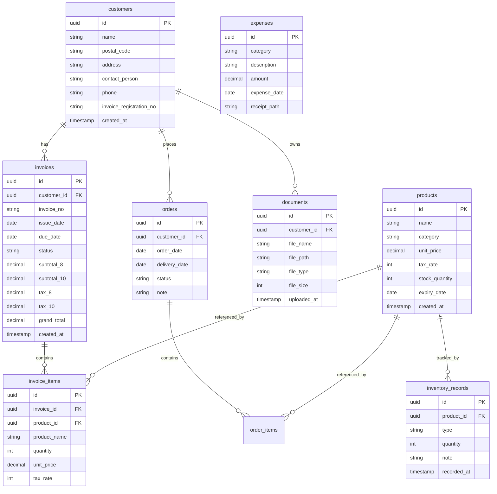

# 個人事業主から業務委託を受け、発酵食品卸の業務管理システムを一人で完遂した話

## はじめに

父が営む発酵食品・漬物の卸業（屋号：旬の和菜）の業務を見ていて、あることが気になっていた。

**請求書はExcelで手書き、在庫は紙の台帳、注文はLINEと電話で口頭確認。**

食品卸業は得意先ごとに税率・納品サイクル・支払条件が異なり、さらに2023年10月からインボイス制度が始まって請求書フォーマットの要件も厳しくなった。このまま紙とExcelで運用し続けることへの限界を感じていた。

「これ、システム化できる」と確信して声をかけたのが今回のプロジェクトの始まりだ。

**業務委託契約を結び、約2ヶ月で要件定義から本番デプロイまで一人で完遂した。現在も父の事業で毎日稼働している。**

:::message
本記事は開発の全体像（要件定義・設計・アジャイル開発・デプロイ・手順書配布）をまとめたものです。
技術的に詰まったポイント（Docker内部通信・日本語ファイル名・型エラー等）の詳細は別記事にまとめています。
→ [Next.js + NestJS + Docker + さくらVPSで詰まった5つのポイントと解決策](#) ※公開中
:::

### 完成したシステムの主な画面

| 機能 | 内容 |
|---|---|
| ダッシュボード | 月別売上・顧客別売上・カテゴリ別経費をRechartsで可視化 |
| 請求書管理 | 軽減税率8%/10%対応・Excel自動出力（インボイス形式） |
| 在庫管理 | 入出荷記録・賞味期限アラート |
| 経費管理 | 勘定科目別分類・CSV出力（弥生/マネーフォワード対応） |
| 書類アーカイブ | 日本語ファイル名対応・顧客名・年月での絞り込み |
| 注文・カレンダー | 仮入力→確定ボタン→カレンダー自動反映 |

---

## §1 要件定義・ヒアリングの進め方

### 非エンジニアからの業務フローヒアリング

父はITに不慣れなため、「どんな機能が欲しいか」を直接聞いても具体的な答えは出てこない。そこで**「今どうやっているか」を先に徹底的に聞く**方針にした。

ヒアリングで使った質問リスト（抜粋）：

```
- 一日の業務の流れを朝から順番に教えてください
- 一番時間がかかっていることは何ですか？
- 月末に何が大変ですか？
- 請求書を送るまでの手順を教えてください
- 在庫が足りなくなったときどうやって気づきますか？
- 得意先ごとに違うルールはありますか？（支払い条件・値引き等）
```

このヒアリングから出てきた業務課題をNotionにまとめ、「課題 → 解決する機能」の形で整理した。

### PowerPointで提案資料を作ってクライアント合意を取る

いきなりコードを書き始めず、**まずPowerPointで「こんなシステムを作ります」という提案資料を作り、父にプレゼンして合意を得た。**

提案資料の構成：
1. 現状の課題（ヒアリング結果をそのまま図解）
2. 解決するシステムのイメージ（画面モックアップ）
3. 実装する機能一覧と優先順位
4. 開発スケジュール（スプリント単位）
5. 完成後の運用フロー

非エンジニアのクライアントに「どんなものができるか」をイメージしてもらうためには、技術的な説明よりも**「今の業務がこう変わります」という具体的なビフォーアフター**が効果的だった。

この提案段階で合意を取っておくことで、開発中の「こんなつもりじゃなかった」を防げる。

### インボイス制度・軽減税率の要件化

食品卸業特有の要件として、2023年10月施行のインボイス制度への対応が必要だった。

調査して判明した要件：
- 適格請求書には**登録番号・税率ごとの消費税額の明記**が義務
- 食品は軽減税率8%、容器・送料等は標準税率10%
- **同一請求書内に8%と10%の品目が混在する**ケースが多い
- Excel出力時もこのフォーマットを再現する必要がある

これをそのまま機能要件に落とし込んだ（実装詳細は[技術編](https://zenn.dev/kenpersonal2507/articles/kazuna-system-tech-tips)参照）。

---

## §2 技術選定の理由

### なぜこのスタックを選んだか

| 技術 | 選定理由 | 不採用の代替案 |
|---|---|---|
| **Next.js 15（App Router）** | SSR・RSCでSEO不要なため過剰だが、自分のメイン技術なので開発速度が出る | Remix（学習コストあり） |
| **NestJS** | TypeScriptファースト・DI・デコレータでコードが整理しやすい。規模が大きくなっても破綻しない | Express（小規模なら十分だが構造化が大変） |
| **PostgreSQL** | 全文検索（pg_trgm）・集計クエリに強い。書類検索で活用 | MySQL（JSON型の扱いが若干劣る） |
| **Docker Compose** | 本番と開発環境を完全に一致させられる。VPS移行が楽 | PM2直接デプロイ（環境差異のリスクあり） |
| **さくらVPS** | 月額数百円〜・日本リージョン・SSHで完全制御できる | Vercel（サーバーサイド処理に制限あり）/ AWS（コスト過多） |

「最新・最適」より「**自分が速く動けて、本番まで持っていける**」を優先した技術選定。個人事業主向けシステムはスピードと安定性がすべてで、過剰な技術選定はリスクにしかならない。

---

## §3 システム設計

### アーキテクチャ図

```
┌─────────────────────── さくらVPS（Ubuntu 22.04 / 1GB）────────────────────────┐
│                                                                                  │
│  ┌──────────────────────── Docker Compose ──────────────────────────────────┐  │
│  │                                                                            │  │
│  │  ┌─────────────┐   :80/:443   ┌──────────────┐                           │  │
│  │  │   nginx     │◄────────────►│  Next.js 15  │  :3000                    │  │
│  │  │ (リバースプロキシ)│             │  (App Router) │                           │  │
│  │  └─────────────┘             └──────┬───────┘                           │  │
│  │                                      │ http://backend:3001（内部通信）      │  │
│  │                               ┌──────▼───────┐                           │  │
│  │                               │   NestJS     │  :3001                    │  │
│  │                               │  (REST API)  │                           │  │
│  │                               └──────┬───────┘                           │  │
│  │                                      │                                    │  │
│  │                               ┌──────▼───────┐                           │  │
│  │                               │ PostgreSQL 15 │  :5432                   │  │
│  │                               └──────────────┘                           │  │
│  │                                                                            │  │
│  │  ┌──────────────────────────────────────────────────────────────────────┐ │  │
│  │  │  ボリューム: postgres_data（永続化）/ uploads（書類ファイル）           │ │  │
│  │  └──────────────────────────────────────────────────────────────────────┘ │  │
│  └────────────────────────────────────────────────────────────────────────────┘  │
│                                                                                  │
└──────────────────────────────────────────────────────────────────────────────────┘
                │
           ブラウザ（父のPC・スマホ）
```

### ER図（主要テーブル）



設計で意識したポイント：

- **`invoice_items` に `product_name` を冗長保持**：商品マスターが後から変更されても請求書の履歴が変わらないようにする
- **`invoices` に `subtotal_8 / subtotal_10 / tax_8 / tax_10` を分けて保持**：税率別集計をSQLで効率よく行うため
- **`documents` のファイルパスはサーバーのローカルパス**：S3は不要なコストなのでVPSのボリュームに保存

---

## §4 アジャイル開発 — 9スプリントの全体像

### スプリント構成

1スプリント = 約1週間。MVPから始めて段階的に機能を積み上げた。

| Sprint | 実装機能 | 技術的なポイント |
|---|---|---|
| **1** | 顧客マスターCRUD | NestJS + TypeORM基盤構築、JWT認証 |
| **2** | 請求書管理（基本） | 軽減税率8%/10%計算ロジック |
| **3** | 請求書Excelエクスポート | xlsxライブラリ、インボイス形式 |
| **4** | 書類アーカイブ | Multerファイルアップロード、日本語ファイル名対応 |
| **5** | 経費管理 | 勘定科目マスター、CSVエクスポート |
| **6** | ダッシュボード | Recharts、月次集計SQL |
| **7** | 在庫管理 | 入出荷記録、賞味期限アラート |
| **8** | 注文・カレンダー管理 | 仮入力→確定フロー、カレンダーUI |
| **9** | 本番デプロイ・調整 | さくらVPS、Docker Compose本番設定 |

### 一人アジャイルで意識したこと

**優先順位の決め方：「父が今週困っていること」を最初に解決する。**

Sprint 1で顧客マスターを作ったのは、他のすべての機能が顧客IDに依存するからだけでなく、「得意先ごとの情報管理が一番煩雑だ」というヒアリング結果があったから。

各スプリントの終わりに父に見せて「これで合ってる？」を確認した。非エンジニアからのフィードバックは「ここのボタンがわかりにくい」「この数字が月末に合わない」といった具体的なものが多く、技術的なレビューよりも実用性の確認として機能した。

---

## §5 VPSデプロイ手順

### さくらVPS初期設定の要点

```bash
# SSHで接続後、まず一般ユーザー作成
adduser ken
usermod -aG sudo ken

# SSH公開鍵認証の設定
mkdir ~/.ssh && chmod 700 ~/.ssh
# authorized_keysにローカルの公開鍵を追記

# パスワード認証を無効化（/etc/ssh/sshd_config）
PasswordAuthentication no
PermitRootLogin no

# UFWでポート制限
ufw allow 22
ufw allow 80
ufw allow 443
ufw enable

# DockerとDocker Composeのインストール
curl -fsSL https://get.docker.com | sh
sudo usermod -aG docker ken
```

### Docker Compose本番構成

```yaml
# docker-compose.prod.yml
services:
  nginx:
    image: nginx:alpine
    ports:
      - "80:80"
    volumes:
      - ./nginx/nginx.conf:/etc/nginx/nginx.conf:ro
    depends_on:
      - frontend

  frontend:
    build:
      context: ./frontend
      dockerfile: Dockerfile.prod
    environment:
      - INTERNAL_API_URL=http://backend:3001
      - NEXT_PUBLIC_API_URL=http://<VPSのIPアドレス>:3001
    depends_on:
      - backend

  backend:
    build:
      context: ./backend
      dockerfile: Dockerfile.prod
    environment:
      - DATABASE_URL=postgresql://kazuna:${DB_PASSWORD}@db:5432/kazuna_db
      - JWT_SECRET=${JWT_SECRET}
    depends_on:
      - db

  db:
    image: postgres:15-alpine
    environment:
      - POSTGRES_DB=kazuna_db
      - POSTGRES_USER=kazuna
      - POSTGRES_PASSWORD=${DB_PASSWORD}
    volumes:
      - postgres_data:/var/lib/postgresql/data

volumes:
  postgres_data:
```

### 本番起動・確認

```bash
# .envに DB_PASSWORD と JWT_SECRET を設定してから起動
docker compose -f docker-compose.prod.yml up -d

# ログ確認
docker compose logs -f

# 全コンテナの状態確認
docker compose ps
```

スワップメモリの設定や1GBメモリ制限での詰まりポイントは[技術編](https://zenn.dev/kenpersonal2507/articles/kazuna-system-tech-tips)に詳しく書いています。

---

## §6 手順書（PowerPoint）の作り方と配布

### なぜ手順書が必要か

システムを作っても使ってもらえなければ意味がない。特に非エンジニアのユーザーにとって「わからなければ聞けばいい」は心理的ハードルが高い。**「自分一人でも操作できる」という安心感を与えること**が最大の目標だった。

### 手順書の設計方針

**1スライド＝1操作** を徹底した。

```
悪い例：
「請求書を作成して得意先に送付する方法」（1スライドに7ステップ）

良い例：
「①新しい請求書を作る」
「②品目を追加する」
「③税率を選ぶ」
「④Excelで出力する」
「⑤保存する」
（5スライドに分割）
```

各スライドの構成：
- **タイトル**：「〇〇をするには」という形式
- **スクリーンショット**：実際の画面（赤枠・矢印で操作箇所を明示）
- **手順**：3行以内のシンプルな説明
- **注意点**：間違えやすいポイントのみ記載

### 配布と運用フロー

PDFに変換してLINEで送付した。「印刷して手元に置いておける」形にした方が使ってもらいやすいとわかったため。

アップデート後の手順書更新も、変更した機能のスライドだけ差し替える形で対応できるよう、スライド構成をモジュール化しておいた。

---

## §7 本番稼働後の状況・今後のアップデート予定

### 現在の状況

デプロイ完了後、父に手順書（PowerPoint）と一緒にシステムを引き渡した。現在は実際の業務で使い始めたばかりで、本格的なフィードバックはこれから。

### 今後のアップデート予定

ヒアリングと実運用の中で見えてきた改善点をリストアップしている。

| 優先度 | 内容 |
|---|---|
| 高 | 請求書Excelの項目を実業務に合わせてカスタマイズ |
| 高 | 請求書からGmail作成画面にワンクリックで移れる連携 |
| 高 | 経費CSVの項目・完成度を上げる |
| 中 | 在庫管理・賞味期限アラートの条件をヒアリングして調整 |
| 中 | 書類アーカイブのストレージ使用量アラート機能 |
| 低 | カレンダー・商品スケジュールとメールの連携 |

---

## おわりに

今回のプロジェクトで実感したのは、**「技術力」と「要件定義力」は別物だ**ということ。

コードを書くことよりも、非エンジニアのクライアントから「何を作ればいいか」を引き出すヒアリング、PowerPointで合意形成するプロセス、使い続けてもらうための手順書設計の方が、プロジェクト全体の成否を左右した。

フリーランス・副業でシステム開発を受託する際は、「要件定義〜デプロイ〜運用定着」までをセットで提供できると、クライアントへの価値が格段に上がると感じている。

---

**技術的に詰まったポイントの詳細はこちら：**
→ [Next.js + NestJS + Docker + さくらVPSで詰まった5つのポイントと解決策](#)

**GitHub：** [ken-personal/kazuna-system](https://github.com/ken-personal/kazuna-system)
**スキルシート：** [Notion ポートフォリオ](https://tide-bank-7b4.notion.site/AWS-31b9ee43f66680eeadb1c5f2db6323ee)

副業・業務委託での開発相談は上記Notionページからお気軽にどうぞ。
